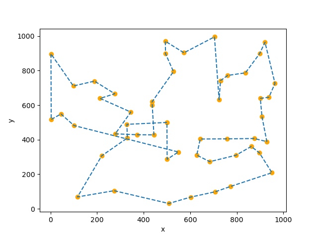
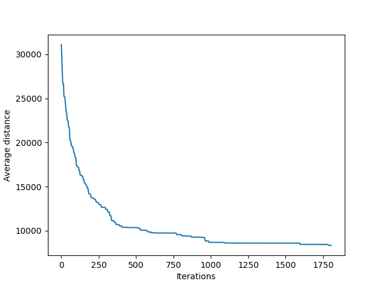

# Bee Genetic Algorithm

Ce projet met en œuvre un algorithme génétique pour résoudre un problème de recherche du meilleur chemin entre une ruche et plusieurs fleurs dispersées dans un espace bidimensionnel.

## Objectif

L'objectif principal de ce projet est de développer un algorithme génétique pour guider un groupe d'abeilles dans la recherche du chemin optimal pour collecter du nectar de fleurs et retourner à la ruche. Les abeilles les plus performantes sont sélectionnées pour la reproduction, créant ainsi une nouvelle génération d'abeilles avec des parcours similaires mais améliorés.

## Configuration du projet

Le projet est organisé comme suit :

- `Hive.py` : Classe principale pour l'algorithme génétique.
- `Bee.py` : Classe représentant une abeille individuelle.
- `utils/` : Répertoire contenant des utilitaires et des fonctions d'assistance.
- `tests/` : Répertoire contenant les tests unitaires du projet.
- `main.py` : Fichier principal pour exécuter l'algorithme génétique.
- `graphs/` : Répertoire où les graphiques générés seront enregistrés.

## Prérequis

Assurez-vous d'avoir les dépendances suivantes installées pour exécuter le projet :

- Python (version 3.11.2)
- Matplotlib (version 3.6.3) : Vous pouvez l'installer en utilisant `pip install matplotlib`.

## Utilisation

Pour utiliser l'algorithme génétique pour trouver le meilleur chemin entre la ruche et les fleurs, suivez ces étapes :

1. Exécutez le fichier `main.py` en utilisant la commande suivante :

   ```bash
   python main.py
   ```

2. L'algorithme génétique sera lancé.

3. Une fois que l'algorithme a convergé, deux graphiques seront générés et enregistrés dans le répertoire `graphs/`. L'un montrera le parcours des abeilles de la dernière génération, tandis que l'autre affichera l'amélioration du parcours au fil des générations.

## Exemple de résultats





