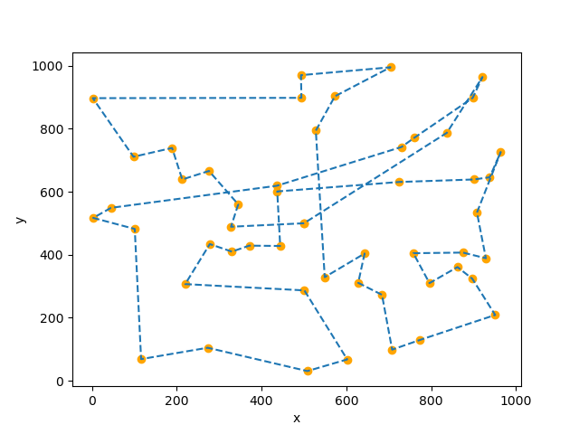
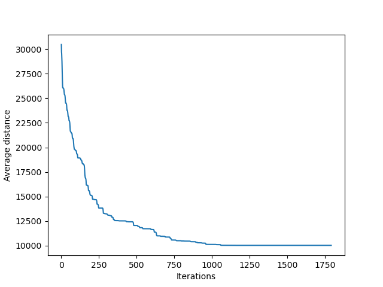

# Bee Genetic Algorithm

This project implements a genetic algorithm to solve a problem of finding the best path between a hive and several randomly scattered flowers in a two-dimensional space.

## Objective

The primary goal of this project is to develop a genetic algorithm to guide a group of bees in finding the optimal path for collecting nectar from flowers and returning to the hive. The most successful bees are selected for reproduction, thereby creating a new generation of bees with similar but improved paths.

## Project Structure

The project is organized as follows:

- `Hive.py`: Main class for the genetic algorithm.
- `Bee.py`: Class representing an individual bee.
- `utils/`: Directory containing utilities and helper functions.
- `tests/`: Directory containing project unit tests.
- `main.py`: Main file to run the genetic algorithm.
- `graphs/`: Directory where generated graphs will be saved.

## Prerequisites

Make sure you have the following dependencies installed to run the project:

- Python (version 3.11.2)
- Matplotlib (version 3.6.3): You can install it using `pip install matplotlib`.

## Usage

To use the genetic algorithm to find the best path between the hive and the flowers, follow these steps:

1. Execute the `main.py` file using the following command:

   ```bash
   python main.py
   ```

2. The genetic algorithm will be launched.

3. Once the algorithm has converged, two graphs will be generated and saved in the `graphs/` directory. One graph will display the path of the bees from the last generation, while the other will show the improvement in the path over generations.

## Example Results




